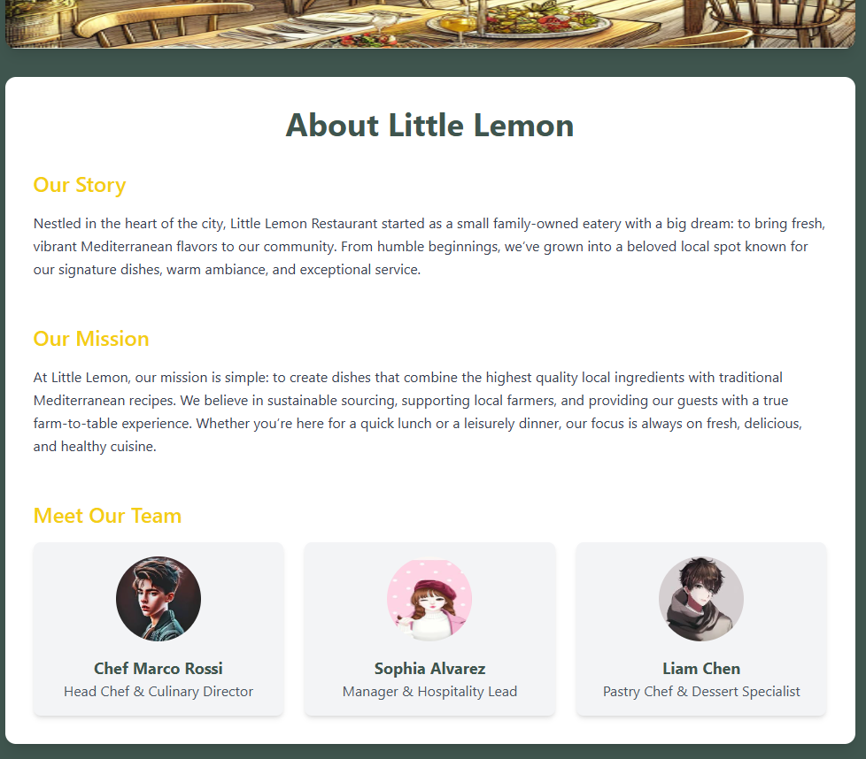
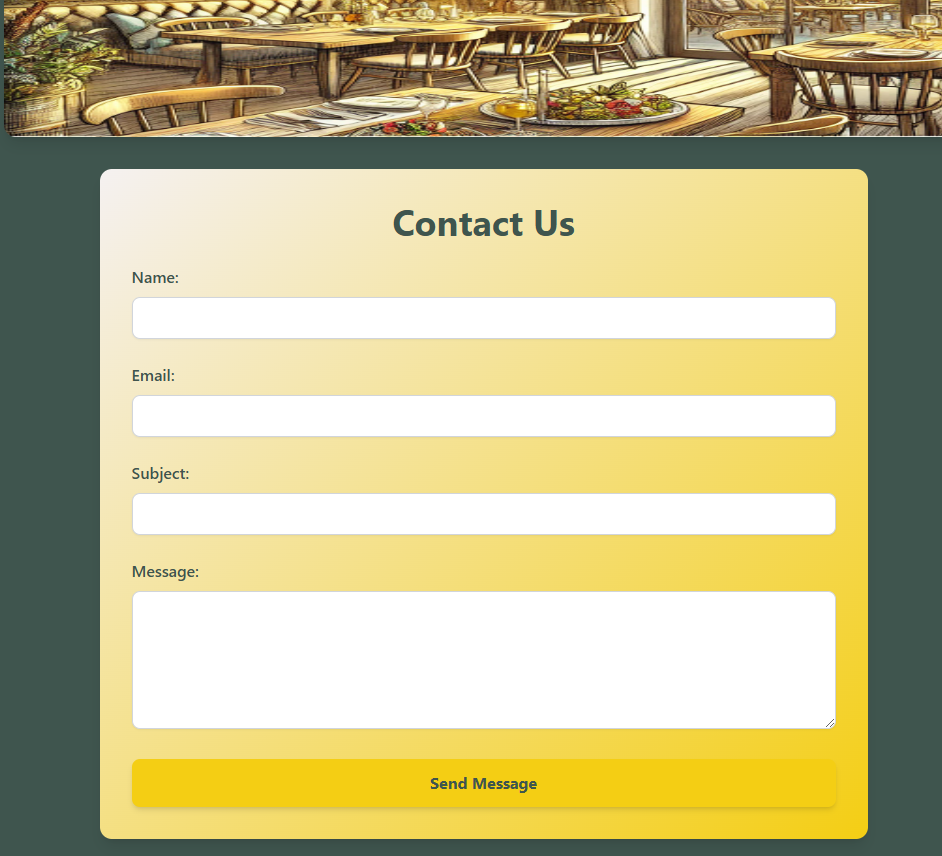
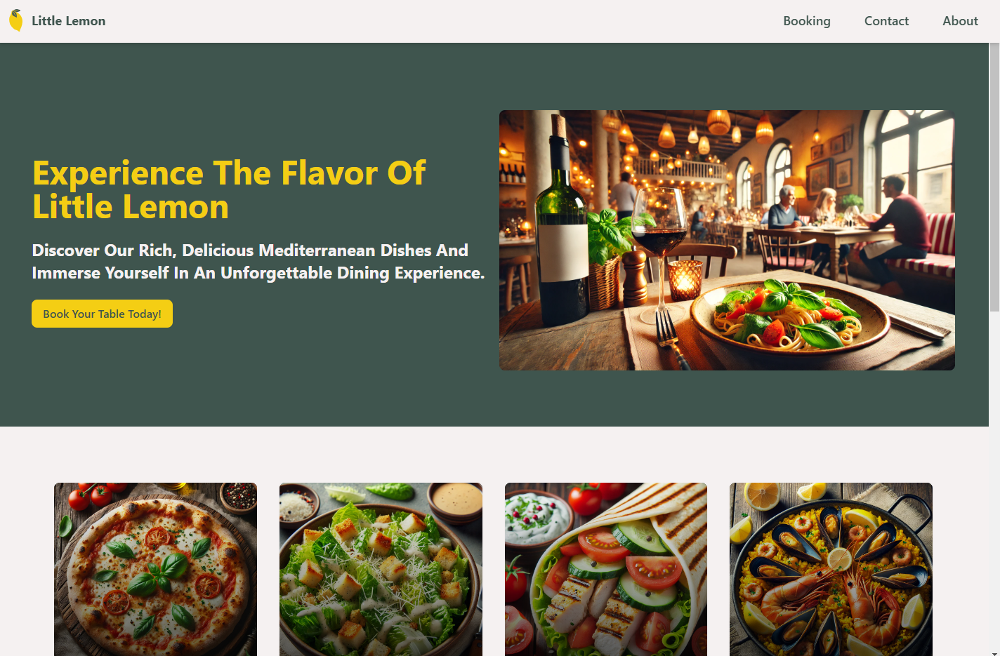
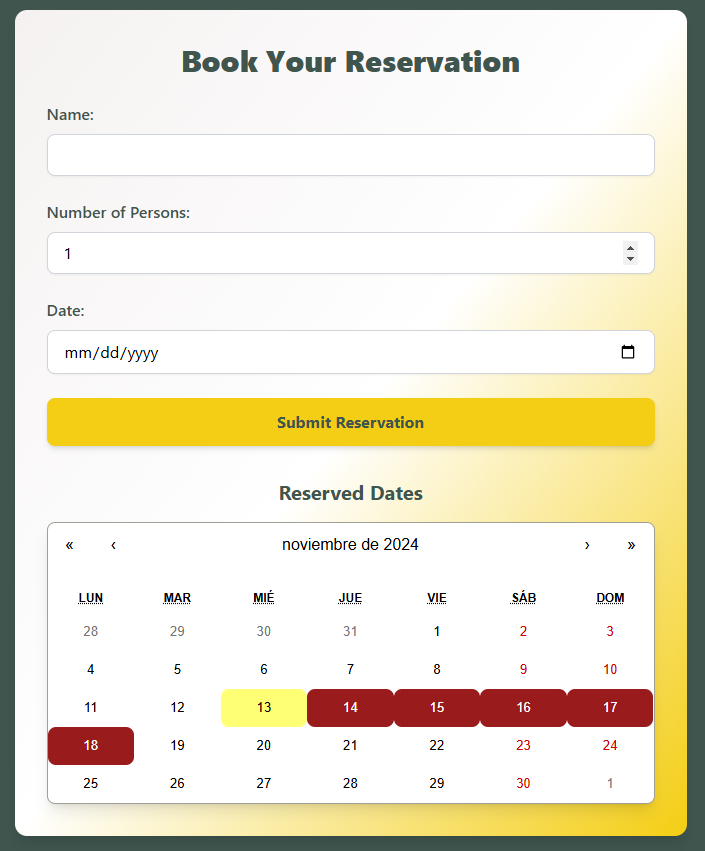

# Little Lemon Restaurant Web Application

Welcome to the **Little Lemon Restaurant** web application! This project is designed to showcase the unique experience that Little Lemon offers, from our delicious Mediterranean-inspired dishes to our friendly team. This web app includes key pages such as **About**, **Contact**, **Loading**, and **Error** pages, all built with React and styled using Tailwind CSS.

[Project Website](https://master.d82nf9zlqp55c.amplifyapp.com/)

## Table of Contents

- [About the Project](#about-the-project)
- [Key Features](#key-features)
- [Technologies Used](#technologies-used)
- [Installation](#installation)
- [Usage](#usage)
- [File Structure](#file-structure)
- [Screenshots](#screenshots)
- [Contributing](#contributing)
- [License](#license)

## About the Project

**Little Lemon Restaurant** is known for its authentic Mediterranean cuisine and welcoming atmosphere. This project captures the essence of the restaurant and brings it to a digital space, allowing users to learn more about Little Lemon, contact the restaurant, and interact with the web app in a smooth and visually engaging manner.

## Key Features

- **Responsive Design**: Built with Tailwind CSS for a responsive and modern UI.
- **Dynamic Pages**:
  - **About Page**: Showcases the history, mission, and team of Little Lemon.
  - **Contact Page**: An interactive form for users to send messages.
  - **Loading Page**: A visually appealing loading screen for a polished experience.
  - **Error Page**: A helpful error page with an option to reload.
- **Integration with React Components**: Modular and reusable components for scalability.

## Technologies Used

- **React**: JavaScript library for building user interfaces.
- **Tailwind CSS**: Utility-first CSS framework for rapid UI development.
- **JavaScript (ES6)**: Modern JavaScript features for better code readability and efficiency.
- **HTML5 & CSS3**: Standard web technologies for structure and styling.

## Installation

### Install dependencies

```bash
npm install
```

### Run the development server

```bash
npm start
```

The app should be running at [http://localhost:3000](http://localhost:3000).

## Usage

### Running the App

After starting the development server, you can navigate to different pages:

- **Home Page**: Add a landing page for users to start their experience.
- **About Page**: Learn more about Little Lemon's story and team.
- **Contact Page**: Fill out and submit the contact form to simulate interaction.
- **Error and Loading Pages**: Simulate these states by introducing loading delays or errors in the code.

### Integrating with Other Projects

Feel free to use components like the `LoadingPage`, `ErrorPage`, or `AboutPage` in your own projects. Each component is modular and built for easy integration.

## File Structure

```plaintext
little-lemon-restaurant/
├── public/
│   └── index.html
├── src/
│   ├── assets/
│   │   └── images/
│   │       └── restaurant-image.png
│   ├── components/
│   │   ├── LoadingPage.jsx
│   │   ├── ErrorPage.jsx
│   │   ├── AboutPage.jsx
│   │   └── ContactForm.jsx
│   ├── App.js
│   ├── index.js
│   └── styles/
│       └── styles.css
├── tailwind.config.js
├── package.json
└── README.md
```

## Screenshots

### About Page



### Contact Page



### Home Page



### Booking Page



## Contributing

Contributions are welcome! If you’d like to contribute to this project:

1. **Fork the repository**.
2. **Create a new branch**:

   ```bash
   git checkout -b feature/new-feature
   ```

3. **Commit your changes**:

   ```bash
   git commit -m 'Add a new feature'
   ```

4. **Push to the branch**:

   ```bash
   git push origin feature/new-feature
   ```

5. **Open a pull request**.

## License

This project is licensed under the MIT License. See the [LICENSE](LICENSE) file for details.
